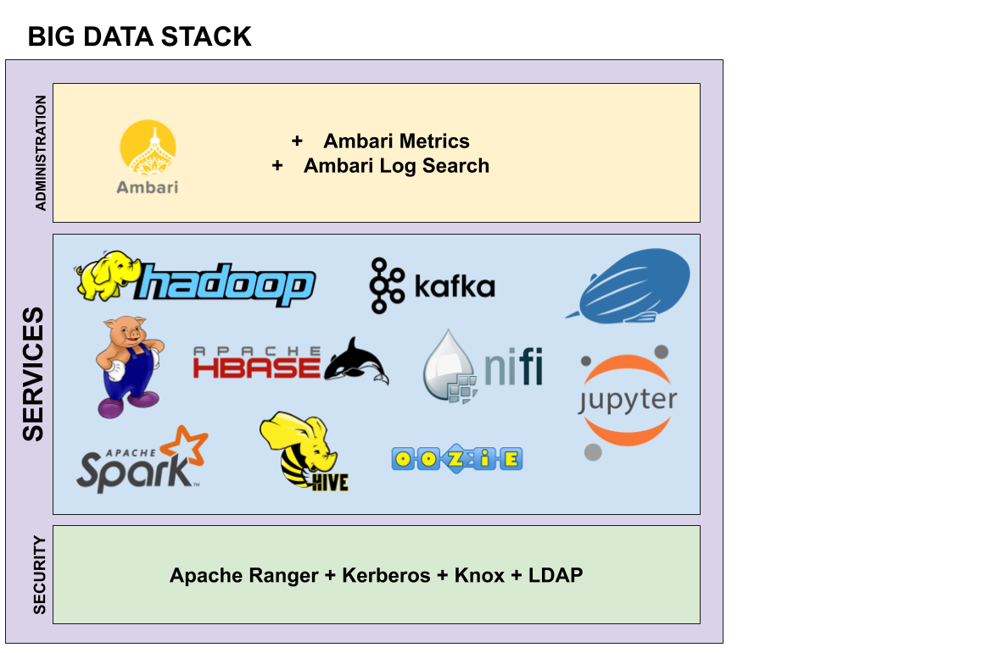

EDI's Big Data Stack architecture
=================================

EDI Big Data Stack leverages on Hortonworks HDP 3.0.0 Hadoop distribution. The
data storage leverages on `Hadoop Distributed File System (HDFS) <http://hadoop.
apache.org/docs/stable/hadoop-project-dist/hadoop-hdfs/HdfsDesign.html>`_.
HDFS is a
distributed file system designed to be used in conjunction with MapReduce jobs.
HDFS is highly fault-tolerant and it is designed to be deployed on low-cost
hardware. A HDFS deployment is formed by a Namenode, which maintains the
file-tree and establishes in which Datanode the data blocks are stored.
Each Datanode is in charge of storing the data, which is usually replicated
by a factor of three.

`YARN (Yet Another Resource Negotiator) <http://hadoop.apache.org/docs/stable/
hadoop-yarn/hadoop-yarn-site/YARN.html, 2018>`_
is deployed on top of the
distributed file system delivered by HDFS. YARN provides resource management
and a central platform in which other services can execute their operations. A
YARN deployment is composed by a Resourcemanager, which allocates resources in
different Nodemanagers. Usually, a worker node on a Hadoop deployment has the
HDFS Datanode and YARN Nodemanager roles assigned.

On top of YARN, different services are offered to the sub-grantees.
`MapReduce <http://hadoop.apache.org/docs/stable/hadoop-mapreduce-client/
hadoop-mapreduce-client-core/MapReduceTutorial.html>`_
is the original framework for processing large amount of data
stored at HDFS. MapReduce splits data into key-value pairs that are processed
in parallel, taking advantage of the aggregation of the processing capacity of
all worker nodes.

YARN opened Hadoop to other data processing engines, being
`Spark <https://spark.apache.org/>`_ one of those.
Spark is an in-memory data processing engine for executing streaming, machine
learning or SQL workloads that require fast iterative access to datasets. Spark
consists of Spark Core, a set of libraries (MLlib for
machine learning, Spark SQL, Spark Streaming and GraphX for graph processing)
and a set of APIs for
developing applications in different languages like Scala, Java, Python and R.

Another processing engine running over YARN is
`Hive <https://hive.apache.org/>`_. Hive allows executing SQL queries over
petabytes of data in Hadoop. In addition, Hive enables allows creating
databases and tables over different types of data stored in HDFS like CSV,
Sequence or JSON files. On the other hand, `Pig <https://pig.apache.org/>`_ is a
scripting platform that eases the processing of large datasets, implementing
multiple typical MapReduce operations, avoiding user coding them.

`HBase <https://hbase.apache.org/>`_ is a NoSQL database engine running on top
of YARN and HDFS. HBase is designed for handling billions of rows and millions
of columns. An HBase deployment consists on a single HBase Master and a set of
RegionServers managing data regions stored on HDFS.

`Kafka <https://kafka.apache.org/>`_ is a scalable, fault-tolerant messaging
system used to replace traditional message brokers like JMS and AMQP because
of higher throughput, reliability and replication. In the same way of those
traditional systems, Kafka relies on message producers, message consumers and
topics.

For orchestrating those services, two frameworks are offered by the Big Data
Stack. The first of them, `Oozie <http://oozie.apache.org/>`_, provides job
scheduling over the cluster, allowing launching jobs from different nature
thanks to a previously designed workflow with the shape of a direct acyclic
graph. On the other hand, `NiFi <https://nifi.apache.org/>`_ automates the
movement of data between different systems of the cluster, and even outside the
cluster. In a similar way to Oozie, NiFi allows creating a conditional workflow
for processing data through different systems. Although NiFi is not provided by
default by Hortonworks HDP, it is accessible thanks to the Hortonworks HDF and
HDP integration.

At last, but not least, we offer different services for interacting with those
services: `Jupyter Notebook <https://jupyter.org/>`,
`Apache Zeppelin <https://zeppelin.apache.org/>`_ and Ambari Views. All your
interactions with the Big Data Stack must be done through those services that
are accesible from your preferred web browser. Jupyter Notebook (accessible at
`<https://jupyter.edincubator.eu>`_) provides an isolated work environment in
which each user can launch jobs at the Big Data Stack through its CLI terminal
and interact with different services through its kernels. In a similar way,
Apache Zeppelin (accesible at `<https://zeppelin.edincubator.eu>`_) allows
creating interactive notebooks using technologies like Spark or Hive. On the
other hand, Ambari Views (`<https://ambari.edincubator.eu>`_) allow accessing
to services like WebHDFS, Pig and Hive editors and Oozie visual workflow
manager.

Due the shared nature of the computation environment, in which different
sub-grantees will share storage and computation resources, the security is a
key asset for the Big Data Stack. The secure access to every resource in the
cluster must be guaranteed, including files stored in HDFS, Hive and HBase
databases, Kafka topics, and NiFi workflows. For achieving those security
challenges, a combination of Kerberos, OpenLDAP and Apache Ranger is used in
the Big Data Stack.

`Kerberos <https://web.mit.edu/kerberos/>`_ is an authentication protocol for
client/server applications by using secret-key cryptography. Ambari uses
Kerberos to avoid identity impersonation inside de cluster, avoiding
non-authenticated users accessing to its resources. As explained in
:ref:`authenticating-with-kerberos`, a client must authenticate itself using
the kinit command and insert her Kerberos principal (username@realm) and
provided keytab. As Kerberos is limited to the command line interface (CLI), an
`OpenLDAP <https://www.openldap.org/,>`_ service is used as Kerberos backend
for storing user credentials. As Ambari allows synchronizing its users with the
ones at an LDAP/AD directory, a user can access to both CLI tools and web-based
tools with the same username and password.

For managing authorization, the platform provides
`Apache Ranger <https://ranger.apache.org/,>`_. Apache Ranger is centralized
security framework that allows establishing fine-grained authorization policies
for multiple components from Hadoop ecosystem. Ranger allows granting access to
different user or groups of users, at different permission levels like read,
write, update, create, drop, alter, index, and other operations, depending on
the component.

For learning how to interact with the Big Data Stack, check
:ref:`basicconcepts`.

.. _tools-and-versions:

Tools and versions
------------------

In the following table versions of the different tools of the stack are shown:

+-----------+---------+
| Tool      | Version |
+===========+=========+
| Hadoop    | 3.1.0   |
+-----------+---------+
| Tez       | 0.9.1   |
+-----------+---------+
| Hive      | 3.1.0   |
+-----------+---------+
| HBase     | 2.0.0   |
+-----------+---------+
| Pig       | 0.16.0  |
+-----------+---------+
| Oozie     | 4.3.1   |
+-----------+---------+
| Kafka     | 1.0.1   |
+-----------+---------+
| Ranger    | 1.1.0   |
+-----------+---------+
| Spark2    | 2.3.1   |
+-----------+---------+

Cluster URLs
------------

The following table shows useful URLs in the cluster:

+-----------+-------------------------------------------------------------+
| Tool      | URL                                                         |
+===========+=============================================================+
| Ambari    | `<https://ambari.edincubator.eu>`_                          |
+-----------+-------------------------------------------------------------+
| NiFi      | `<https://nifi.edincubator.eu>`_                            |
+-----------+-------------------------------------------------------------+
| Jupyter   | `<https://jupyter.edincubator.eu>`_                         |
| Notebook  |                                                             |
+-----------+-------------------------------------------------------------+
| Zeppelin  | `<https://zeppelin.edincubator.eu>`_                        |
+-----------+-------------------------------------------------------------+
| YARN UI   | `<https://edi-master.novalocal:8443/gateway/hdp/yarnuiv2>`_ |
+-----------+-------------------------------------------------------------+
