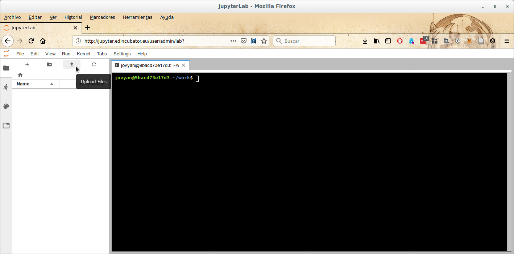
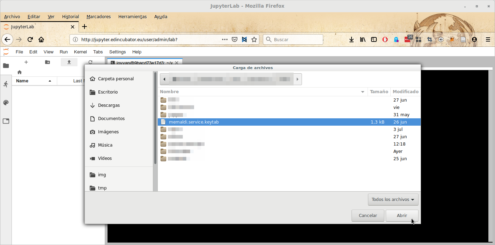
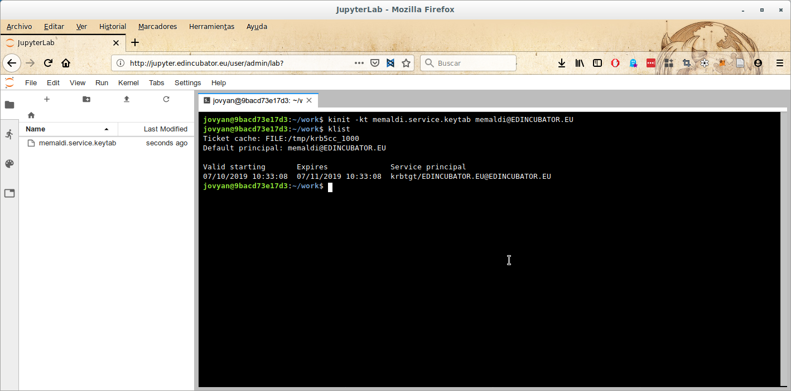

.. _basicconcepts:

EDI Big Data Stack Basic Concepts
=================================

How to access to services provided by the Big Data Stack
--------------------------------------------------------

All services provided by EDI's Big Data Stack are only accessible through the
different provided web services (Jupyter Notebook, Apache Zeppelin, Apache
NiFi, and Ambari Views). In this section, we explain which functionalities can
you access through each tool.

Jupyter Notebook
----------------

Jupyter Notebook (`<https://jupyter.edincubator.eu>`_) allows accessing to all
services through its web CLI terminal. In addition it provides a set of kernels
in order to allow interactively accessing to different services at the Big Data
Stack. For accessing to your Jupyter Notebook instance, you must access to
`<https://jupyter.edincubator.eu>`_ and enter your credentials. Once your
instance is spawned, you can start working at the Big Data Stack. You can learn
more about JupyterLab at
`<https://jupyterlab.readthedocs.io/en/stable/user/interface.html>`_.

TODO: screenshots.

.. note::

  You can install custom Python libraries through `pip` and `conda`
  package managers at your JupyterLab instance. However, we advice against
  executing anything "locally" at your JupyterLab instance, because its
  restricted computation resources. See :ref:`creating-docker-images` for
  learning how to launch custom Docker images at the cluster.

.. _authenticating-with-kerberos:

Authenticating with Kerberos
----------------------------

Before doing anything at Jupyter Notebook, you must authenticate using
your `Kerberos <https://web.mit.edu/kerberos/>`_ credentials. Kerberos is a
network authentication protocol which provides strong authentication for
client/server applications by using secret-key cryptography.

For authenticating yourself, first you must upload the keytab provided within
your credentials.

Next, you must launch a new terminal and introduce the following command:

.. code-block:: console

  # kinit -kt <your-keytab> <username>@EDINCUBATOR.EU

You can check the status of your Kerberos ticket using the `klist` command:

.. code-block:: console

  # klist
  Ticket cache: FILE:/tmp/krb5cc_0
  Default principal: <user>@EDINCUBATOR.EU

  Valid starting     Expires            Service principal
  04/12/18 09:53:28  04/13/18 09:53:28  krbtgt/EDINCUBATOR.EU@EDINCUBATOR.EU

Once you have a valid ticket, you can work at EDI Big Data Stack until the
ticket expires. If the ticket expires, you must execute again `kinit` command.

TODO: screenshots

Tools provided by EDI Big Data Stack
------------------------------------

For illustrating the different tools provided by EDI Big Data Stack through
Jupyter Notebook this documentations follows a workflow using the
`Yelp Dataset from Kaggle <https://www.kaggle.com/yelp-dataset/yelp-dataset>`_.
We recommend following proposed workflow from beggining to the end for getting
a global view of tools provided by EDI Big Data Stack.

.. toctree::
   :maxdepth: 1

   tools/hdfs
   tools/map-reduce
   tools/spark2
   tools/hive
   tools/hbase
   tools/kafka
   tools/pig
   tools/oozie
   tools/nifi
   tools/zeppelin
   tools/views
   tools/jupyterhub
   tools/creating-docker-images
