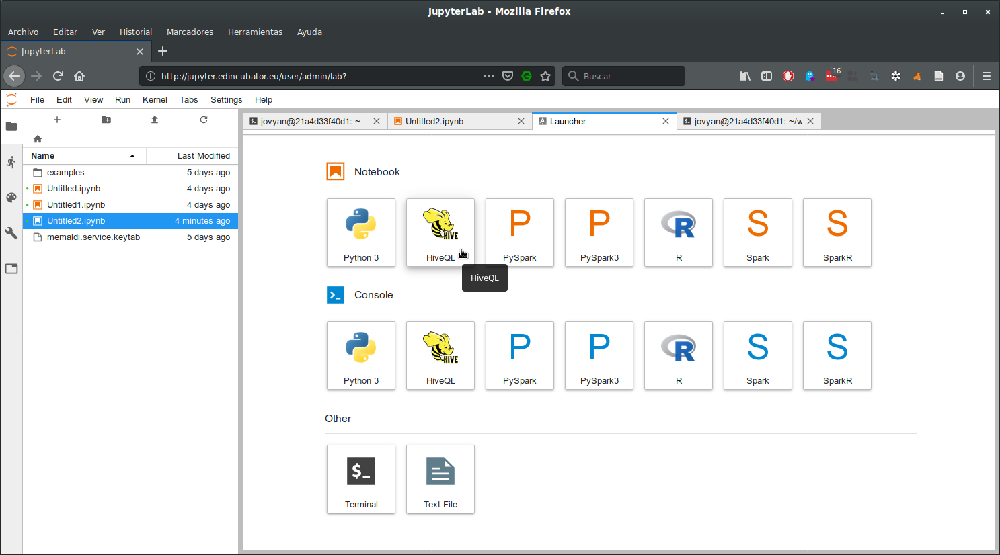
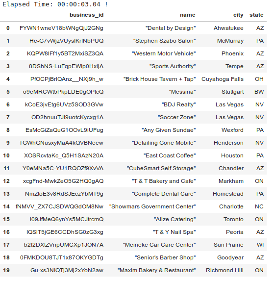
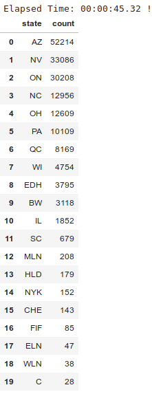

.. warning::

  Remember that for interacting with EDI Big Data Stack you must be
  authenticated at the system using `kinit` command. For more information, read
  the documentation at :ref:`authenticating-with-kerberos`.

Hive
====

Hive allows executing querying files stored at a distributed storage with a
SQL-like language name HQL (Hive Query Language). In this tutorial we explain
how to use Hive with sample files introduced in :ref:`hdfs` within EDI Big Data
Stack.

.. note::
  If you need a new Hive database, you need to contact with :ref:`technical-support` for
  creating the database and give you the proper permissions. For avoiding conflicts, all
  databases must follow the `username_databasename` convention.

For interacting with Hive, the HiveQL kernel is available at Jupyter Lab:

For connecting to the Hive database `<username>_yelp`, we must execute insert
the following configuration at the first paragraph of the notebook:

.. code-block:: console

  $$ url=hive://<username>@edi-master.novalocal:10000/<username>
  $$ connect_args={"auth": "KERBEROS","kerberos_service_name": "hive"}

As Hive needs `all` permissions on dataset's folder, you must copy the
`yelp_business` folder to your home directory.

.. code-block:: console

  # hdfs dfs -cp /samples/yelp/yelp_business /user/<username>/

First we need to create table `yelp_business`. As we want to ingest CSV data, we
are going to use `Hive CSV Serde <https://cwiki.apache.org/confluence/display/Hive/CSV+Serde>`_:

.. code-block:: SQL

    CREATE EXTERNAL TABLE IF NOT EXISTS yelp_business (
      business_id string,
      name string,
      neighborhood string,
      address string,
      city string,
      state string,
      postal_code int,
      latitude double,
      longitude double,
      stars float,
      review_count int,
      is_open boolean,
      categories string
    )
    ROW FORMAT SERDE 'org.apache.hadoop.hive.serde2.OpenCSVSerde'
    WITH SERDEPROPERTIES (
       "separatorChar" = ",",
       "quoteChar"     = '"',
       "escapeChar"    = '"'
    )
    STORED AS TEXTFILE
    LOCATION '/user/<username>/yelp_business'
    TBLPROPERTIES("skip.header.line.count"="1");

Once the data has been imported from the CSV into the table you can execute SQL
commands to query the data

.. code-block:: SQL

  select business_id, name, city, state from yelp_business limit 20;

Next, we can execute SQL queries over the table. In our case, we want to get
the ordered list of states with most businesses:

.. code-block:: SQL

  select state, count(state) as count from yelp_business group by state order by count desc;

