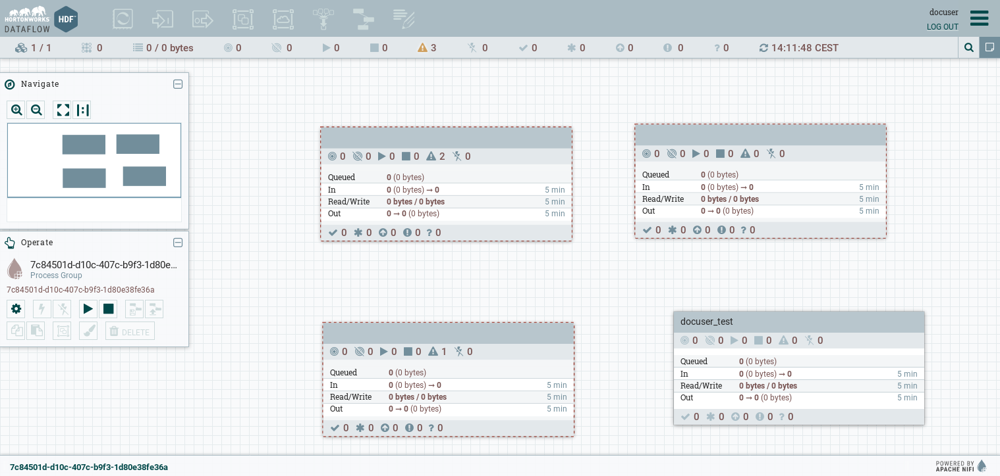
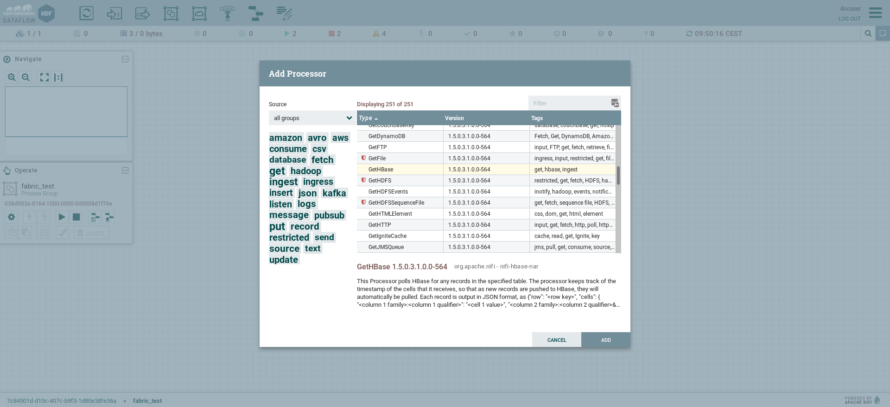
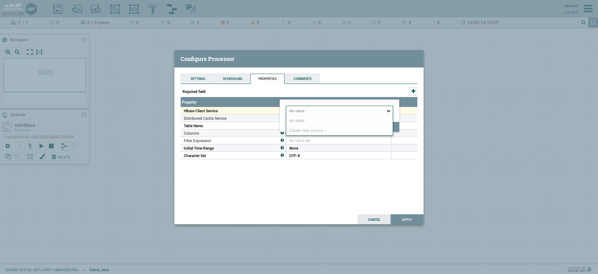
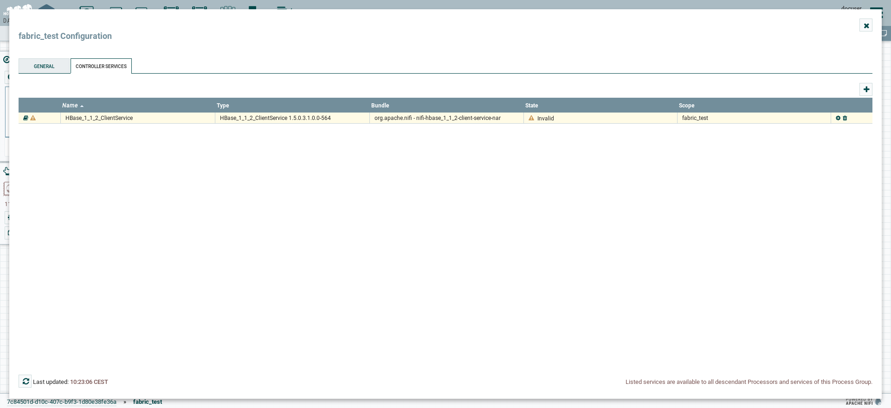
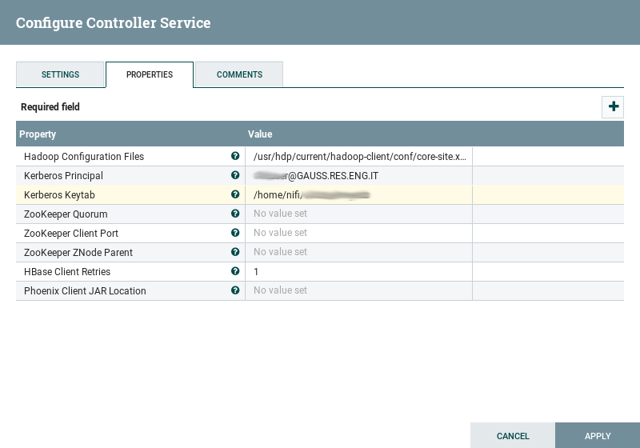
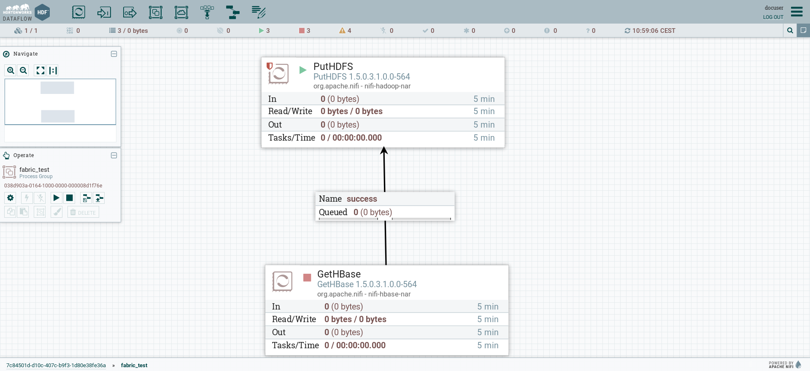
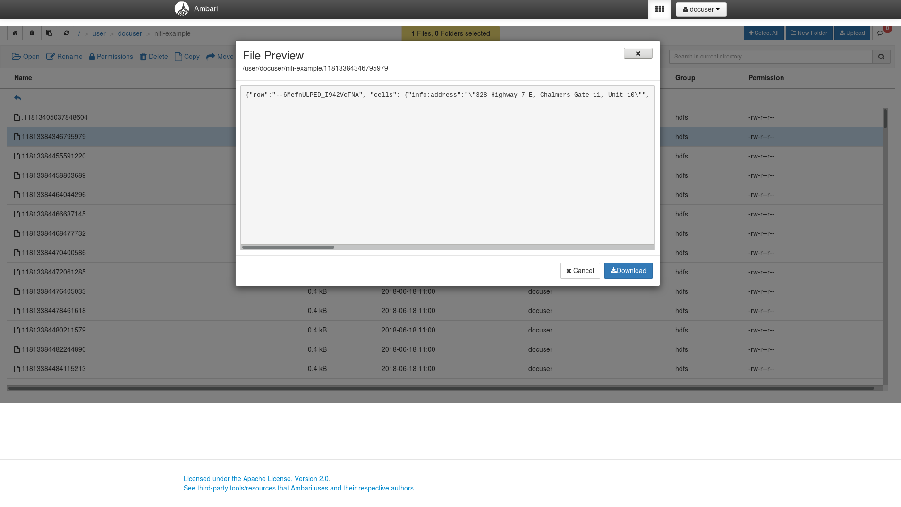

NiFi
====

`Apache Nifi <https://nifi.apache.org/>`_ is a system to process and distribute
data. It allows creating directed graphs of data routing, tranformation and
system mediation logic. It provides a web interface for easily developing its
flows.

Creating a NiFi Flow
--------------------

.. warning::

  In EDI every NiFi flow must be created within a Nifi process group. If you
  need a new NiFi process group, you need to contact with EDI Technical
  Support for creating the process group and giving you the proper permissions.
  Once you have your process group set, you can continue with this tutorial.
  For avoiding conflicts, all process groups must follow the
  `username_processgroupname` convention.

NiFi web interface is accessible at
`https://master.edincubator.eu:9091/nifi/ <https://master.edincubator.eu:9091/nifi/>`_.
From here, you must enter your EDI Big Data Stack credentials.

In the main grid, although you can view process groups belonging to other
users, you can only view details and edit your own process groups.

Double clicking on one of your process groups, you can add elements to this
process group. In this tutorial we are going to make a simple workflow that
retrieves Yelp Business information from :ref:`HBase` and puts at a HDFS folder
in JSON format.

For adding a processor, drag and drop the `Processor` icon from the toolbar to
the grid, select `GetHBase` processor and click `ADD`.

The `GetHBase` processor will appear at the grid. Double click into it for
exploring its settings. At `properties` tab, you can see mandatory
properties bolded. At `Table Name` property, write the table from which you
want to extract data (in `namespace:table` format).

For `HBase Client Service` you must assign or create a new service. For doing
that, click on `HBase Client Service` value cell and click on
`Create new service...` at the opened dialog.

Here, you must create a `HBase_1_1_2_ClientService` controller service, the
only one provided by EDI Big Data Stack for connecting to HBase from NiFi.
After creating the service, you must configure it clicking into the arrow next
to the value of the property. When prompted about saving the changes, click
`Yes` and proceed to configure the controller service clicking in the cog
symbol.

Here, you must configure at least the following properties:

* **Hadoop Configuration Files**: at this property you must set the path to
  Hadoop and HBase configuration files. In this case, the value of this
  property must be `/usr/hdp/current/hadoop-client/conf/core-site.xml,/usr/hdp/current/hbase-client/conf/hbase-site.xml`.
* **Kerberos Principal**: your Kerberos principal, i.e. `username@EDINCUBATOR.EU`.
* **Kerberos Keytab**: your Kerberos NiFi keytab in the following format:
  `/home/nifi/{your-kerberos-nifi-keytab}`.

Close the window clicking on `Apply` and enable the controller service clicking
on the lightning bolt icon and clicking `Enable` at the raising modal window.

Next, you must redirect the output of the `GetHBase` processor. In this example,
we are going to save results at HDFS. For that, we are going to use the
`PutHDFS` processor.

.. warning::

  A white and red shield near to the component name means that this component is
  restricted, These are components that can be used to execute arbitrary
  unsanitized code provided by the operator through the NiFi REST API/UI or can
  be used to obtain or alter data on the NiFi host system using the NiFi OS
  credentials. These components could be used by an otherwise authorized NiFi
  user to go beyond the intended use of the application, escalate privilege,
  or could expose data about the internals of the NiFi process or the host
  system. If you want to use any of those components, contact with :ref:`technical-support`.

For configuring the `PutHDFS` processor, the EDI technical support team must
know at least the value for the following properties:

* **Kerberos Principal**: your Kerberos principal, i.e. `username@EDINCUBATOR.EU`.
* **Kerberos Keytab**: your Kerberos NiFi keytab in the following format:
  `/home/nifi/{your-kerberos-nifi-keytab}`.
* **Directory**: the HDFS directory in which the processor must save its output.
* **Input**: the input processor for the `PutHDFS` processor.
* **Results flow**: indicate if you want to autoterminate success and fail outputs
  or to redirect them to another component.

Once the processor is configured, you will see it on the grid, and at running
state.

At last, select the `GetHBase` processor and click the play icon at the left of
the grid. After few seconds, the flow will start working and sending data from
HBase to HDFS. Check the folder at HDFS and you will see a JSON file for each
HBase row.

