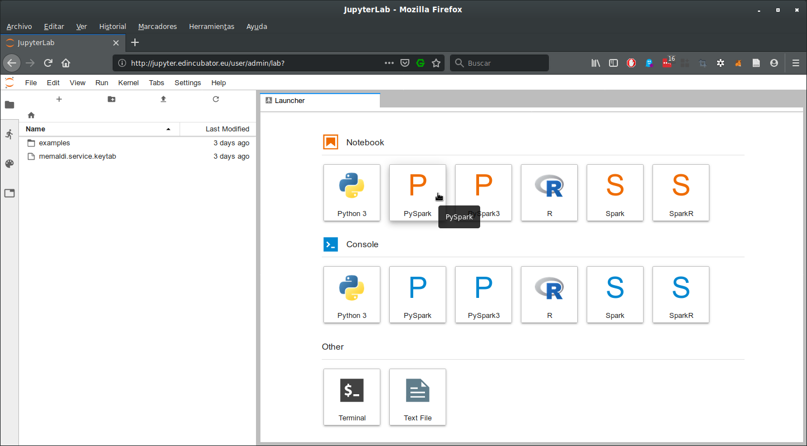

.. warning::

  Remember that for interacting with EDI Big Data Stack you must be
  authenticated at the system using `kinit` command. For more information, read
  the documentation at :ref:`authenticating-with-kerberos`.

.. _spark2:

Spark2
======

EDI Big Data Stack includes Spark2 engine. In this tutorial, we explain how to
interact with Spark2 through SparkMagic kernel provided by JupyterLab and how
to submit a Python job to the cluster. For illustrating this, we are going to
perform some operations over the sample dataset introduced at :ref:`hdfs`.

SparkMagic
----------

`SparkMagic <https://github.com/jupyter-incubator/sparkmagic>`_ is a Jupyter kernel which allows communicating interactively with a
Spark remote cluster. Available kernels within SparkMagic are PySpark,
PySpark3, Spark and SparkR.

TODO: check availability of PySpark3

.. note::

  SparkMagic doesn't allow importing libraries not included with Spark, Scala,
  R or Python by default. If you need to use additional dependencies to process
  your data, you could do it separately in another different job. See :ref:`creating-docker-images`
  for learning how to launch your custom Docker images at the cluster.

You can launch a new notebook selecting one of those kernels at the welcome
window at JupyterLab. In this tutorial we are going to use the PySpark kernel:

At the notebook, you can interact with the SparkContext and SparkSession at
`sc` and `spark` variables:

.. _spark-yelp-example:

Yelp example
............

First, we will load the sample file yelp_business.csv:

.. code-block:: console

  >>> business_df = spark.read.csv('/samples/yelp/yelp_business/yelp_business.csv', header=True, quote='"', escape='"')
  >>> business_df.show()
  +--------------------+--------------------+------------------+--------------------+--------------+-----+-----------+-------------+--------------+-----+------------+-------+--------------------+
  |         business_id|                name|      neighborhood|             address|          city|state|postal_code|     latitude|     longitude|stars|review_count|is_open|          categories|
  +--------------------+--------------------+------------------+--------------------+--------------+-----+-----------+-------------+--------------+-----+------------+-------+--------------------+
  |FYWN1wneV18bWNgQj...|  "Dental by Design"|              null|"4855 E Warner Rd...|     Ahwatukee|   AZ|      85044|   33.3306902|  -111.9785992|  4.0|          22|      1|Dentists;General ...|
  |He-G7vWjzVUysIKrf...|"Stephen Szabo Sa...|              null|"3101 Washington Rd"|      McMurray|   PA|      15317|   40.2916853|   -80.1048999|  3.0|          11|      1|Hair Stylists;Hai...|
  |KQPW8lFf1y5BT2Mxi...|"Western Motor Ve...|              null|"6025 N 27th Ave,...|       Phoenix|   AZ|      85017|   33.5249025|  -112.1153098|  1.5|          18|      1|Departments of Mo...|
  |8DShNS-LuFqpEWIp0...|  "Sports Authority"|              null|"5000 Arizona Mil...|         Tempe|   AZ|      85282|   33.3831468|  -111.9647254|  3.0|           9|      0|Sporting Goods;Sh...|
  |PfOCPjBrlQAnz__NX...|"Brick House Tave...|              null|      "581 Howe Ave"|Cuyahoga Falls|   OH|      44221|   41.1195346|   -81.4756898|  3.5|         116|      1|American (New);Ni...|
  |o9eMRCWt5PkpLDE0g...|           "Messina"|              null|    "Richterstr. 11"|     Stuttgart|   BW|      70567|      48.7272|       9.14795|  4.0|           5|      1| Italian;Restaurants|
  |kCoE3jvEtg6UVz5SO...|        "BDJ Realty"|         Summerlin|"2620 Regatta Dr,...|     Las Vegas|   NV|      89128|     36.20743|    -115.26846|  4.0|           5|      1|Real Estate Servi...|
  |OD2hnuuTJI9uotcKy...|       "Soccer Zone"|              null|"7240 W Lake Mead...|     Las Vegas|   NV|      89128|   36.1974844|  -115.2496601|  1.5|           9|      1|Shopping;Sporting...|
  |EsMcGiZaQuG1OOvL9...|  "Any Given Sundae"|              null|"2612 Brandt Scho...|       Wexford|   PA|      15090|40.6151022445|-80.0913487465|  5.0|          15|      1|Coffee & Tea;Ice ...|
  |TGWhGNusxyMaA4kQV...|"Detailing Gone M...|              null|                  ""|     Henderson|   NV|      89014|36.0558252127| -115.04635039|  5.0|           7|      1|Automotive;Auto D...|
  |XOSRcvtaKc_Q5H1SA...| "East Coast Coffee"|              null|  "737 West Pike St"|       Houston|   PA|      15342|40.2415480142|-80.2128151059|  4.5|           3|      0|Breakfast & Brunc...|
  |Y0eMNa5C-YU1RQOZf...|"CubeSmart Self S...|              null|"2414 South Gilbe...|      Chandler|   AZ|      85286|   33.2717201|  -111.7912569|  5.0|          23|      1|Local Services;Se...|
  |xcgFnd-MwkZeO5G2H...|"T & T Bakery and...|   Markham Village|  "35 Main Street N"|       Markham|   ON|    L3P 1X3|   43.8751774|   -79.2601532|  4.0|          38|      1|Bakeries;Bagels;Food|
  |NmZtoE3v8RdSJEczY...|"Complete Dental ...|              null|  "107 Whitaker Str"|     Homestead|   PA|      15120|   40.4014882|   -79.8879161|  2.0|           5|      1|General Dentistry...|
  |fNMVV_ZX7CJSDWQGd...|"Showmars Governm...|            Uptown|      "600 E 4th St"|     Charlotte|   NC|      28202|   35.2216474|   -80.8393449|  3.5|           7|      1|Restaurants;Ameri...|
  |l09JfMeQ6ynYs5MCJ...|    "Alize Catering"|Yonge and Eglinton|     "2459 Yonge St"|       Toronto|   ON|    M4P 2H6|   43.7113993|   -79.3993388|  3.0|          12|      0|Italian;French;Re...|
  |IQSlT5jGE6CCDhSG0...|    "T & Y Nail Spa"|              null|"8411 W Thunderbi...|        Peoria|   AZ|      85381|   33.6086538|  -112.2400118|  3.0|          20|      1|Beauty & Spas;Nai...|
  |b2I2DXtZVnpUMCXp1...|"Meineke Car Care...|              null|  "2518 Ironwood Dr"|   Sun Prairie|   WI|      53590|     43.18508|    -89.262047|  3.5|           9|      1|Tires;Oil Change ...|
  |0FMKDOU8TJT1x87OK...|"Senior's Barber ...|              null|  "13375 W McDowell"|      Goodyear|   AZ|      85395|    33.463629|   -112.347038|  5.0|          65|      1|Barbers;Beauty & ...|
  |Gu-xs3NIQTj3Mj2xY...|"Maxim Bakery & R...|              null|"9665 Bayview Ave...| Richmond Hill|   ON|    L4C 9V4|   43.8675648|   -79.4126618|  3.5|          34|      1|French;Food;Baker...|
  +--------------------+--------------------+------------------+--------------------+--------------+-----+-----------+-------------+--------------+-----+------------+-------+--------------------+
  only showing top 20 rows
  >>>

See that with Spark2 we can easily load and preview a CSV file. Like in the
:ref:`mapreduce` example, we can count how many businesses each state has:

.. code-block:: console

  >>> state_count = business_df.groupBy(business_df.state).count()
  >>> state_count.show()
  +-----+-----+
  |state|count|
  +-----+-----+
  |   AZ|52214|
  |   SC|  679|
  |   SL|    1|
  |   BW| 3118|
  |   MN|    1|
  |  ZET|    1|
  |    3|    1|
  |   30|    1|
  |  FAL|    1|
  |  KHL|    1|
  |   01|   10|
  |  NYK|  152|
  |  NTH|    2|
  |  HLD|  179|
  |  SCB|    5|
  |   VA|    1|
  | null|    1|
  |   QC| 8169|
  |    B|    1|
  |   KY|    1|
  +-----+-----+
  only showing top 20 rows

  >>>

Although some data cleaning is needed, with Spark2 we can operate over data
easily. Now, we are going to sort the result and store into HDFS.

.. code-block:: console

  >>> sorted_state_count = state_count.sort("count", ascending=False)
  >>> sorted_state_count.show()
  +-----+-----+
  |state|count|
  +-----+-----+
  |   AZ|52214|
  |   NV|33086|
  |   ON|30208|
  |   NC|12956|
  |   OH|12609|
  |   PA|10109|
  |   QC| 8169|
  |   WI| 4754|
  |  EDH| 3795|
  |   BW| 3118|
  |   IL| 1852|
  |   SC|  679|
  |  MLN|  208|
  |  HLD|  179|
  |  NYK|  152|
  |  CHE|  143|
  |  FIF|   85|
  |  ELN|   47|
  |  WLN|   38|
  |    C|   28|
  +-----+-----+

  only showing top 20 rows

  >>> sorted_state_count.write.csv('/user/<username>/spark-csv-output')

If we check contents of '/user/<username>/spark-csv-output', we can see that
a set of CSV files have been generated, one for each partition.

.. code-block:: console

  # hdfs dfs -ls /user/<username>/spark-csv-output
  Found 22 items
  -rw-r--r--   3 <username> hdfs          0 2019-07-18 11:04 /user/<username>/spark-csv-output/_SUCCESS
  -rw-r--r--   3 <username> hdfs          8 2019-07-18 11:04 /user/<username>/spark-csv-output/part-00000-8ee0ea94-b478-42ec-9c22-90ac373500fb-c000.csv
  -rw-r--r--   3 <username> hdfs          8 2019-07-18 11:04 /user/<username>/spark-csv-output/part-00001-8ee0ea94-b478-42ec-9c22-90ac373500fb-c000.csv
  -rw-r--r--   3 <username> hdfs          8 2019-07-18 11:04 /user/<username>/spark-csv-output/part-00002-8ee0ea94-b478-42ec-9c22-90ac373500fb-c000.csv
  -rw-r--r--   3 <username> hdfs          8 2019-07-18 11:04 /user/<username>/spark-csv-output/part-00003-8ee0ea94-b478-42ec-9c22-90ac373500fb-c000.csv
  -rw-r--r--   3 <username> hdfs          8 2019-07-18 11:04 /user/<username>/spark-csv-output/part-00004-8ee0ea94-b478-42ec-9c22-90ac373500fb-c000.csv
  -rw-r--r--   3 <username> hdfs          7 2019-07-18 11:04 /user/<username>/spark-csv-output/part-00005-8ee0ea94-b478-42ec-9c22-90ac373500fb-c000.csv
  -rw-r--r--   3 <username> hdfs          7 2019-07-18 11:04 /user/<username>/spark-csv-output/part-00006-8ee0ea94-b478-42ec-9c22-90ac373500fb-c000.csv
  -rw-r--r--   3 <username> hdfs          7 2019-07-18 11:04 /user/<username>/spark-csv-output/part-00007-8ee0ea94-b478-42ec-9c22-90ac373500fb-c000.csv
  -rw-r--r--   3 <username> hdfs          8 2019-07-18 11:04 /user/<username>/spark-csv-output/part-00008-8ee0ea94-b478-42ec-9c22-90ac373500fb-c000.csv
  -rw-r--r--   3 <username> hdfs          7 2019-07-18 11:04 /user/<username>/spark-csv-output/part-00009-8ee0ea94-b478-42ec-9c22-90ac373500fb-c000.csv
  -rw-r--r--   3 <username> hdfs          7 2019-07-18 11:04 /user/<username>/spark-csv-output/part-00010-8ee0ea94-b478-42ec-9c22-90ac373500fb-c000.csv
  -rw-r--r--   3 <username> hdfs          6 2019-07-18 11:04 /user/<username>/spark-csv-output/part-00011-8ee0ea94-b478-42ec-9c22-90ac373500fb-c000.csv
  -rw-r--r--   3 <username> hdfs          7 2019-07-18 11:04 /user/<username>/spark-csv-output/part-00012-8ee0ea94-b478-42ec-9c22-90ac373500fb-c000.csv
  -rw-r--r--   3 <username> hdfs          7 2019-07-18 11:04 /user/<username>/spark-csv-output/part-00013-8ee0ea94-b478-42ec-9c22-90ac373500fb-c000.csv
  -rw-r--r--   3 <username> hdfs          7 2019-07-18 11:04 /user/<username>/spark-csv-output/part-00014-8ee0ea94-b478-42ec-9c22-90ac373500fb-c000.csv
  -rw-r--r--   3 <username> hdfs          7 2019-07-18 11:04 /user/<username>/spark-csv-output/part-00015-8ee0ea94-b478-42ec-9c22-90ac373500fb-c000.csv
  -rw-r--r--   3 <username> hdfs          6 2019-07-18 11:04 /user/<username>/spark-csv-output/part-00016-8ee0ea94-b478-42ec-9c22-90ac373500fb-c000.csv
  -rw-r--r--   3 <username> hdfs          6 2019-07-18 11:04 /user/<username>/spark-csv-output/part-00017-8ee0ea94-b478-42ec-9c22-90ac373500fb-c000.csv
  -rw-r--r--   3 <username> hdfs          6 2019-07-18 11:04 /user/<username>/spark-csv-output/part-00018-8ee0ea94-b478-42ec-9c22-90ac373500fb-c000.csv
  -rw-r--r--   3 <username> hdfs         11 2019-07-18 11:04 /user/<username>/spark-csv-output/part-00019-8ee0ea94-b478-42ec-9c22-90ac373500fb-c000.csv
  -rw-r--r--   3 <username> hdfs         52 2019-07-18 11:04 /user/<username>/spark-csv-output/part-00020-8ee0ea94-b478-42ec-9c22-90ac373500fb-c000.csv

  # hdfs dfs -cat /user/<username>/spark-csv-output/part-00000-8ee0ea94-b478-42ec-9c22-90ac373500fb-c000.csv
  AZ,52214
  #

In the same way, we can also export those results in JSON format:

.. code-block:: console

  >>> sorted_state_count.write.json('/user/<username>/spark-json-output')

.. code-block:: console

  # hdfs dfs -ls /user/<username>/spark-json-output
  Found 32 items
  -rw-------   3 <username> <username>          0 2018-04-13 12:40 /user/<username>/spark-json-output/_SUCCESS
  -rw-------   3 <username> <username>         29 2018-04-13 12:40 /user/<username>/spark-json-output/part-00000-dbbde83a-f730-459f-a8bb-54b50cbab72e-c000.json
  -rw-------   3 <username> <username>         29 2018-04-13 12:40 /user/<username>/spark-json-output/part-00001-dbbde83a-f730-459f-a8bb-54b50cbab72e-c000.json
  -rw-------   3 <username> <username>         29 2018-04-13 12:40 /user/<username>/spark-json-output/part-00002-dbbde83a-f730-459f-a8bb-54b50cbab72e-c000.json
  -rw-------   3 <username> <username>         29 2018-04-13 12:40 /user/<username>/spark-json-output/part-00003-dbbde83a-f730-459f-a8bb-54b50cbab72e-c000.json
  -rw-------   3 <username> <username>         29 2018-04-13 12:40 /user/<username>/spark-json-output/part-00004-dbbde83a-f730-459f-a8bb-54b50cbab72e-c000.json
  -rw-------   3 <username> <username>         29 2018-04-13 12:40 /user/<username>/spark-json-output/part-00005-dbbde83a-f730-459f-a8bb-54b50cbab72e-c000.json
  -rw-------   3 <username> <username>         28 2018-04-13 12:40 /user/<username>/spark-json-output/part-00006-dbbde83a-f730-459f-a8bb-54b50cbab72e-c000.json
  -rw-------   3 <username> <username>         28 2018-04-13 12:40 /user/<username>/spark-json-output/part-00007-dbbde83a-f730-459f-a8bb-54b50cbab72e-c000.json
  -rw-------   3 <username> <username>         29 2018-04-13 12:40 /user/<username>/spark-json-output/part-00008-dbbde83a-f730-459f-a8bb-54b50cbab72e-c000.json
  -rw-------   3 <username> <username>         28 2018-04-13 12:40 /user/<username>/spark-json-output/part-00009-dbbde83a-f730-459f-a8bb-54b50cbab72e-c000.json
  -rw-------   3 <username> <username>         28 2018-04-13 12:40 /user/<username>/spark-json-output/part-00010-dbbde83a-f730-459f-a8bb-54b50cbab72e-c000.json
  -rw-------   3 <username> <username>         27 2018-04-13 12:40 /user/<username>/spark-json-output/part-00011-dbbde83a-f730-459f-a8bb-54b50cbab72e-c000.json
  -rw-------   3 <username> <username>         28 2018-04-13 12:40 /user/<username>/spark-json-output/part-00012-dbbde83a-f730-459f-a8bb-54b50cbab72e-c000.json
  -rw-------   3 <username> <username>         28 2018-04-13 12:40 /user/<username>/spark-json-output/part-00013-dbbde83a-f730-459f-a8bb-54b50cbab72e-c000.json
  -rw-------   3 <username> <username>         28 2018-04-13 12:40 /user/<username>/spark-json-output/part-00014-dbbde83a-f730-459f-a8bb-54b50cbab72e-c000.json
  -rw-------   3 <username> <username>         28 2018-04-13 12:40 /user/<username>/spark-json-output/part-00015-dbbde83a-f730-459f-a8bb-54b50cbab72e-c000.json
  -rw-------   3 <username> <username>         27 2018-04-13 12:40 /user/<username>/spark-json-output/part-00016-dbbde83a-f730-459f-a8bb-54b50cbab72e-c000.json
  -rw-------   3 <username> <username>         27 2018-04-13 12:40 /user/<username>/spark-json-output/part-00017-dbbde83a-f730-459f-a8bb-54b50cbab72e-c000.json
  -rw-------   3 <username> <username>         27 2018-04-13 12:40 /user/<username>/spark-json-output/part-00018-dbbde83a-f730-459f-a8bb-54b50cbab72e-c000.json
  -rw-------   3 <username> <username>         25 2018-04-13 12:40 /user/<username>/spark-json-output/part-00019-dbbde83a-f730-459f-a8bb-54b50cbab72e-c000.json
  -rw-------   3 <username> <username>         26 2018-04-13 12:40 /user/<username>/spark-json-output/part-00020-dbbde83a-f730-459f-a8bb-54b50cbab72e-c000.json
  -rw-------   3 <username> <username>         27 2018-04-13 12:40 /user/<username>/spark-json-output/part-00021-dbbde83a-f730-459f-a8bb-54b50cbab72e-c000.json
  -rw-------   3 <username> <username>         26 2018-04-13 12:40 /user/<username>/spark-json-output/part-00022-dbbde83a-f730-459f-a8bb-54b50cbab72e-c000.json
  -rw-------   3 <username> <username>         52 2018-04-13 12:40 /user/<username>/spark-json-output/part-00023-dbbde83a-f730-459f-a8bb-54b50cbab72e-c000.json
  -rw-------   3 <username> <username>         25 2018-04-13 12:40 /user/<username>/spark-json-output/part-00024-dbbde83a-f730-459f-a8bb-54b50cbab72e-c000.json
  -rw-------   3 <username> <username>         51 2018-04-13 12:40 /user/<username>/spark-json-output/part-00025-dbbde83a-f730-459f-a8bb-54b50cbab72e-c000.json
  -rw-------   3 <username> <username>         51 2018-04-13 12:40 /user/<username>/spark-json-output/part-00026-dbbde83a-f730-459f-a8bb-54b50cbab72e-c000.json
  -rw-------   3 <username> <username>        101 2018-04-13 12:40 /user/<username>/spark-json-output/part-00027-dbbde83a-f730-459f-a8bb-54b50cbab72e-c000.json
  -rw-------   3 <username> <username>        153 2018-04-13 12:40 /user/<username>/spark-json-output/part-00028-dbbde83a-f730-459f-a8bb-54b50cbab72e-c000.json
  -rw-------   3 <username> <username>        694 2018-04-13 12:40 /user/<username>/spark-json-output/part-00029-dbbde83a-f730-459f-a8bb-54b50cbab72e-c000.json
  -rw-------   3 <username> <username>          0 2018-04-13 12:40 /user/<username>/spark-json-output/part-00030-dbbde83a-f730-459f-a8bb-54b50cbab72e-c000.json
  # hdfs dfs -cat /user/<username>/spark-json-output/part-00000-dbbde83a-f730-459f-a8bb-54b50cbab72e-c000.json
  {"state":"AZ","count":52214}
  #

spark-submit
------------

In order to execute the same job in a distributed way, we are going to code the
previous instructions into a Python file. You can find yelp_example.py inside
the `spark2example` folder at examples directory.

.. code-block:: python

  import argparse
  from pyspark.sql import SparkSession

  parser = argparse.ArgumentParser(description='Execute Spark2 Yelp example.')
  parser.add_argument(
      '--app_name', type=str, help="Application name", default='YelpExample')
  parser.add_argument('input_file', type=str, help="Input CSV file")
  parser.add_argument('output_dir', type=str, help="Output directory")

  args = parser.parse_args()

  spark = SparkSession.builder.appName(args.app_name).getOrCreate()
  business_df = spark.read.csv(args.input_file,
                               header=True, quote='"', escape='"')

  state_count = business_df.groupBy(business_df.state).count()
  sorted_state_count = state_count.sort("count", ascending=False)
  sorted_state_count.write.csv(args.output_dir)

.. note::

  Don't forget to include `--master yarn` and `--deploy-mode cluster` parameters
  in order to compute the job in the cluster instead of locally.

.. warning::

  YARN does not overwrite non empty directories. Ensure to delete
  `/user/<username>/spark-csv-output` directory before submiting the job again.

.. code-block:: console

  # spark-submit --master yarn --deploy-mode cluster examples/spark2example/yelp_example.py /samples/yelp/yelp_business/yelp_business.csv /user/<username>/spark-csv-output --app_name <username>YelpExample
  18/10/10 10:38:14 WARN util.NativeCodeLoader: Unable to load native-hadoop library for your platform... using builtin-java classes where applicable
  18/10/10 10:38:15 WARN shortcircuit.DomainSocketFactory: The short-circuit local reads feature cannot be used because libhadoop cannot be loaded.
  18/10/10 10:38:15 INFO client.RMProxy: Connecting to ResourceManager at master.edincubator.eu/192.168.1.12:8050
  18/10/10 10:38:16 INFO yarn.Client: Requesting a new application from cluster with 4 NodeManagers
  18/10/10 10:38:17 INFO yarn.Client: Verifying our application has not requested more than the maximum memory capability of the cluster (101376 MB per container)
  18/10/10 10:38:17 INFO yarn.Client: Will allocate AM container, with 1408 MB memory including 384 MB overhead
  18/10/10 10:38:17 INFO yarn.Client: Setting up container launch context for our AM
  18/10/10 10:38:17 INFO yarn.Client: Setting up the launch environment for our AM container
  18/10/10 10:38:17 INFO yarn.Client: Preparing resources for our AM container
  18/10/10 10:38:17 INFO security.HadoopFSDelegationTokenProvider: getting token for: DFS[DFSClient[clientName=DFSClient_NONMAPREDUCE_-1732315395_1, ugi=<username>@EDINCUBATOR.EU (auth:KERBEROS)]]
  18/10/10 10:38:18 INFO hdfs.DFSClient: Created HDFS_DELEGATION_TOKEN token 486 for <username> on 192.168.1.12:8020
  18/10/10 10:38:20 INFO yarn.Client: Use hdfs cache file as spark.yarn.archive for HDP, hdfsCacheFile:hdfs://master.edincubator.eu:8020/hdp/apps/2.6.5.0-292/spark2/spark2-hdp-yarn-archive.tar.gz
  18/10/10 10:38:20 INFO yarn.Client: Source and destination file systems are the same. Not copying hdfs://master.edincubator.eu:8020/hdp/apps/2.6.5.0-292/spark2/spark2-hdp-yarn-archive.tar.gz
  18/10/10 10:38:21 INFO yarn.Client: Uploading resource file:/workdir/stack-examples/spark2example/yelp_example.py -> hdfs://master.edincubator.eu:8020/user/<username>/.sparkStaging/application_1539159936594_0011/yelp_example.py
  18/10/10 10:38:23 INFO yarn.Client: Uploading resource file:/usr/hdp/current/spark2-client/python/lib/pyspark.zip -> hdfs://master.edincubator.eu:8020/user/<username>/.sparkStaging/application_1539159936594_0011/pyspark.zip
  18/10/10 10:38:26 INFO yarn.Client: Uploading resource file:/usr/hdp/current/spark2-client/python/lib/py4j-0.10.6-src.zip -> hdfs://master.edincubator.eu:8020/user/<username>/.sparkStaging/application_1539159936594_0011/py4j-0.10.6-src.zip
  18/10/10 10:38:28 INFO yarn.Client: Uploading resource file:/tmp/spark-fa20d514-3a9d-4de3-9a9e-bc356c5c2032/__spark_conf__1996256534625877583.zip -> hdfs://master.edincubator.eu:8020/user/<username>/.sparkStaging/application_1539159936594_0011/__spark_conf__.zip
  18/10/10 10:38:31 INFO spark.SecurityManager: Changing view acls to: <username>
  18/10/10 10:38:31 INFO spark.SecurityManager: Changing modify acls to: <username>
  18/10/10 10:38:31 INFO spark.SecurityManager: Changing view acls groups to:
  18/10/10 10:38:31 INFO spark.SecurityManager: Changing modify acls groups to:
  18/10/10 10:38:31 INFO spark.SecurityManager: SecurityManager: authentication disabled; ui acls disabled; users  with view permissions: Set(<username>); groups with view permissions: Set(); users  with modify permissions: Set(<username>); groups with modify permissions: Set()
  18/10/10 10:38:31 INFO yarn.Client: Submitting application application_1539159936594_0011 to ResourceManager
  18/10/10 10:38:32 INFO impl.YarnClientImpl: Submitted application application_1539159936594_0011
  18/10/10 10:38:33 INFO yarn.Client: Application report for application_1539159936594_0011 (state: ACCEPTED)
  18/10/10 10:38:33 INFO yarn.Client:
  	 client token: Token { kind: YARN_CLIENT_TOKEN, service:  }
  	 diagnostics: AM container is launched, waiting for AM container to Register with RM
  	 ApplicationMaster host: N/A
  	 ApplicationMaster RPC port: -1
  	 queue: default
  	 start time: 1539167911783
  	 final status: UNDEFINED
  	 tracking URL: http://master.edincubator.eu:8088/proxy/application_1539159936594_0011/
  	 user: <username>
  18/10/10 10:38:34 INFO yarn.Client: Application report for application_1539159936594_0011 (state: ACCEPTED)
  18/10/10 10:38:35 INFO yarn.Client: Application report for application_1539159936594_0011 (state: ACCEPTED)
  18/10/10 10:38:36 INFO yarn.Client: Application report for application_1539159936594_0011 (state: ACCEPTED)
  18/10/10 10:38:37 INFO yarn.Client: Application report for application_1539159936594_0011 (state: RUNNING)
  18/10/10 10:38:37 INFO yarn.Client:
  	 client token: Token { kind: YARN_CLIENT_TOKEN, service:  }
  	 diagnostics: N/A
  	 ApplicationMaster host: 192.168.1.24
  	 ApplicationMaster RPC port: 0
  	 queue: default
  	 start time: 1539167911783
  	 final status: UNDEFINED
  	 tracking URL: http://master.edincubator.eu:8088/proxy/application_1539159936594_0011/
  	 user: <username>
  18/10/10 10:38:38 INFO yarn.Client: Application report for application_1539159936594_0011 (state: RUNNING)
  18/10/10 10:38:40 INFO yarn.Client: Application report for application_1539159936594_0011 (state: RUNNING)
  18/10/10 10:38:41 INFO yarn.Client: Application report for application_1539159936594_0011 (state: RUNNING)
  18/10/10 10:38:42 INFO yarn.Client: Application report for application_1539159936594_0011 (state: RUNNING)
  18/10/10 10:38:43 INFO yarn.Client: Application report for application_1539159936594_0011 (state: RUNNING)
  18/10/10 10:38:44 INFO yarn.Client: Application report for application_1539159936594_0011 (state: RUNNING)
  18/10/10 10:38:45 INFO yarn.Client: Application report for application_1539159936594_0011 (state: RUNNING)
  18/10/10 10:38:46 INFO yarn.Client: Application report for application_1539159936594_0011 (state: RUNNING)
  18/10/10 10:38:48 INFO yarn.Client: Application report for application_1539159936594_0011 (state: RUNNING)
  18/10/10 10:38:49 INFO yarn.Client: Application report for application_1539159936594_0011 (state: RUNNING)
  18/10/10 10:38:50 INFO yarn.Client: Application report for application_1539159936594_0011 (state: FINISHED)
  18/10/10 10:38:50 INFO yarn.Client:
  	 client token: N/A
  	 diagnostics: N/A
  	 ApplicationMaster host: 192.168.1.24
  	 ApplicationMaster RPC port: 0
  	 queue: default
  	 start time: 1539167911783
  	 final status: SUCCEEDED
  	 tracking URL: http://master.edincubator.eu:8088/proxy/application_1539159936594_0011/
  	 user: <username>
  18/10/10 10:38:50 INFO util.ShutdownHookManager: Shutdown hook called
  18/10/10 10:38:50 INFO util.ShutdownHookManager: Deleting directory /tmp/spark-447b8972-64d0-43db-b233-3ded18ee4dea
  18/10/10 10:38:50 INFO util.ShutdownHookManager: Deleting directory /tmp/spark-fa20d514-3a9d-4de3-9a9e-bc356c5c2032

You can find more information about the job at
`<https://edi-master.novalocal:8443/gateway/hdp/yarnuiv2/>`_. Check
`/user/<username>/spark-csv-output` directory for the results.
