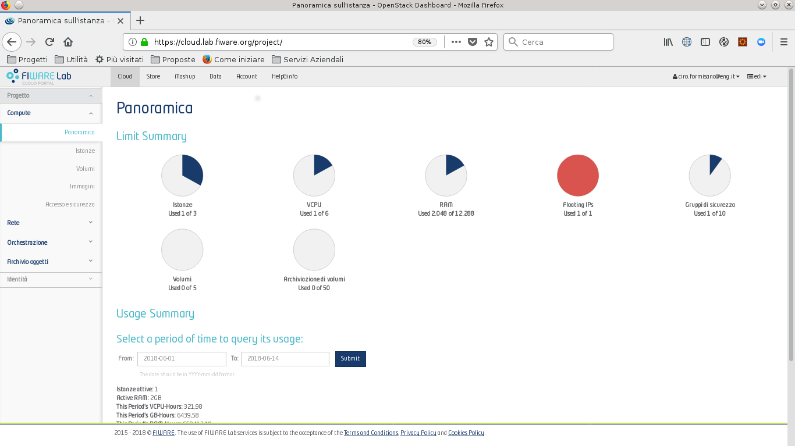
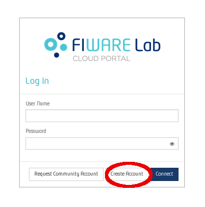
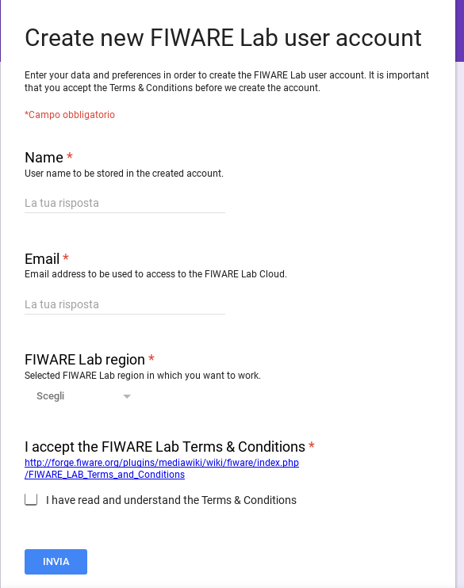

EDI's Application infrastructure
================================
The **Application Infrastructure** integrates the Big Data Infrastructure in order to enable the applicants to expose interfaces, temporarly store data and, more
in general, to deploy specific applications and APIs. Starting from the Explore Phase, the selected applicants can use a set of assigned virtual  machines with
pre-determined features in term of processing power and memory: furthermore it is possible to legerage some pre-built services that can be used to support the deployed
application providing more complex functionalities. In the Experiment phase the resources provided to the applicants could be increased, since it is supposed
that it was the period in which the applications will be developed and deployed.

The Application Infrastructure tries to meet the following requirements:

* **Virtual Machines provisioning**. In order to host the developed applications and, if required, the application containers used to deploy them: a private network must be available to connect the internal services that interoperate to provide the final application.
* **Public IP addresses**. At least a public IP address for each sub-grantees must be provided in order to expose the deployed application on the internet: the possibility to have more than a single public address will depend on the availabilities of the infrastructure provider.
* **Possibility to deploy** different services supporting the final application. In particular, it could be necessary to deploy local databases, brokers and other services interoperating with the application container.
* **Data and application security**. Possibility and easiness to apply the usage terms established by the data providers and the legislations about data and application security.
* **Pre-built Services**. Provided to support and extend what has been developed.

FI-WARE Lab
-----------
`FI-WARE Lab`_ is a working instance of `FI-WARE Platform`_ available for experimentations: it enables to build basic virtual infrastructures,
deploy applications and use the *Generic Enablers*. FI-WARE lab Accounts can be categorized into two types: *Trial* and *Community*. Trial accounts provide
limited resources for a reduced period. A Trial Account provides the following **default** quotas:

* **14 days** of duration
* **one public** IP address (the number of private addresses available is not limited)
* **two** virtual machines instances, each of which has
* **two** virtual CPUs
* **40 GB** of hard disk space
* **4096 Mb** of RAM.

Anyone can request a Trial account: hovewer EDI's applicant admitted to the Explore Phase can get an extended trial period covering the whole Phase.
The Trial Accounts are useful to start the first tests: the applicants that admitted to the Experiment Phase will have their accounts turned into
**Community Accounts**, providing complete functionalities and useful to develop the final versions of the proposed solutions.

FI-WARE Lab Usage
-----------------
In order to create a *Trial Account* the following operations are needed:

1. Go to https://cloud.lab.fiware.org and click on *Create Account*

2. Compile the *account form* and agree the *terms and conditions* document

3. Wait for the confirmation from FI-WARE staff

.. raw:: html

   
4. Send an email to <a class="reference external" href="mailto:support&#37;&#52;&#48;edincubator&#46;eu">support&#64;edincubator&#46;eu</a> asking for the extension of the trial period from 14 days (standard) to the whole Explore Period. The email must contain the email associated with the account. This point is
   <strong>mandatory</strong> to obtain the extension of the trial period.  Please do not forget to send the request.

Besides the Virtual Infrastructure and the set of Virtual Machines, FI-WARE Lab also provides a set of pre-built servces: the  **Generic Enablers** (*GE*).
In particular, FI-WARE Generic Enablers are services that can be combined to extend existing applications by introducing more complex functionalities.
They can be found on `FI-WARE Catalogue`_ page and can be used by selecting an appropriate *image* in the list on `FI-WARE Lab`_ page.

More information of FI-WARE Lab can be found on `FI-WARE Lab Help page`_ and on `FI-WARE Guide`_, which includes useful information on the Generic Enablers.

.. _FI-WARE Lab: https://cloud.lab.fiware.org
.. _FI-WARE Platform: https://www.fiware.org/
.. _FI-WARE Lab Help page: http://help.lab.fiware.org/
.. _FI-WARE Guide: https://fiwaretourguide.readthedocs.io/en/latest/
.. _FI-WARE Catalogue: https://store.lab.fiware.org/

.. _deploying-stack-client:

Deploying Big Data Stack client at FI-WARE
------------------------------------------

The Big Data Stack client could be deployed at an Ubuntu 16.04 or a Centos 7 instance at FIWARE following those steps:

* Deploy an Ubuntu 16.04 instance in FIWARE Lab and connect via SSH.
* Install Docker following instructions at
    * Ubuntu: `<https://docs.docker.com/install/linux/docker-ce/ubuntu/>`_.
    * Centos: `<https://docs.docker.com/install/linux/docker-ce/centos/>`_.
    * Don't forget performing `Post-Installation steps for Linux <https://docs.docker.com/install/linux/linux-postinstall/>`_.
* Upload your VPN credentials file (edi.ovpn) to your instance (e.g. to `/home/ubuntu` folder on Ubuntu or `/home/centos` on Centos).
* Launch a VPN client container (replace `/path/to/vpn-credentials` by `/home/ubuntu` or `/home/centos`):

.. code-block:: console

  $ docker run -it --cap-add=NET_ADMIN --device /dev/net/tun --name vpn -v </path/to/vpn-credentials>:/vpn --dns 192.168.1.11 --dns-search edincubator.eu -d dperson/openvpn-client

* Restart the vpn container:

.. code-block:: console

  $ docker restart vpn

* Check container's logs for checking if the connection is succesful looking for
  `Initialization Sequence Completed` message.
* Pull Big Data Stack's client image from Docker Hub:

.. code-block:: console

  $ sudo docker pull edincubator/stack-client:fiware

* Run and access to the container:

.. code-block:: console

  $ docker run -ti --net=container:vpn -v <workdir>:/workdir --name stack-client edincubator/stack-client:fiware /bin/bash

* Identify yourself with Kerberos:

.. code-block:: console

  $ kinit <username>

  * Check the validity of your Kerberos ticket using `klist` command.
