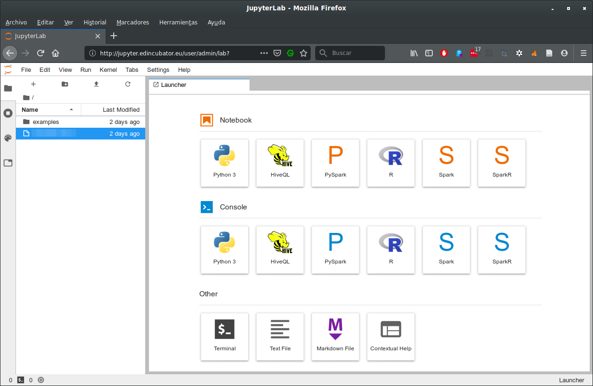
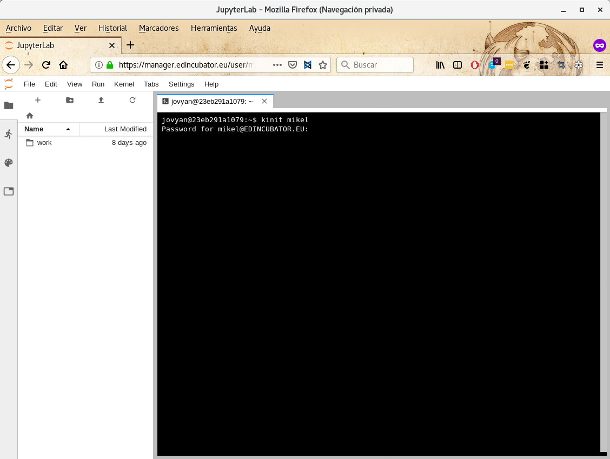

JupyterHub
==========

`JupyterHub <http://jupyter.org/hub>`_ is the multitenant environment for
deploying `Jupyter Notebooks <http://jupyter.org/index.html>`_. The Jupyter
Notebook is an open-source web application that allows you to create and
share documents that contain live code, equations, visualizations and narrative
text. Uses include: data cleaning and transformation, numerical simulation,
statistical modeling, data visualization, machine learning, and much more.

Jupyter Notebook allows you installing whatever Python library you need using
`pip <https://pypi.org/project/pip/>`_ or
`Anaconda <https://www.anaconda.com/>`_. The JupyterHub instance deployed at
EDI allows launching Spark Scala and Python jobs.

You can access to JupyterHub at `<https://manager.edincubator.eu>`_. You can
use your EDI credentials for accessing to your Notebook. The first time you
access to your Notebook it took take a while.

.. note::

  There is no need of connecting to the VPN to access to JupyterHub.

.. image:: img/jupyterhub-login.png

From the main launcher, you can start Scala, Python or R notebooks, as create
generic text files or start terminals.

If you want to access to the cluster at, before starting any notebook, you must
identify yourself at Kerberos executing `kint`. For that, open a new terminal
and execute `kinit <username>`.

.. warning::

  You can invoke `Git <https://git-scm.com/>`_ from terminal. As Notebooks are
  volatile, don't forget pushing your code to your repositories.

Remember that code executed at Notebooks is executed "locally" at the node
where JupyterHub is deployed. If you want to submit your code to the cluster,
you can use the `spark-submit` command located at `/usr/local/spark/bin`. You
can add your additional libraries using `--jars` (Scala) or `--py-files` (Python)
flags.

.. note::

  See `Easiest way to install Python dependencies on Spark executor nodes? <https://stackoverflow.com/questions/29495435/easiest-way-to-install-python-dependencies-on-spark-executor-nodes/35712779#35712779>`_.
  for learning how to submit your virtualenv to Spark.

