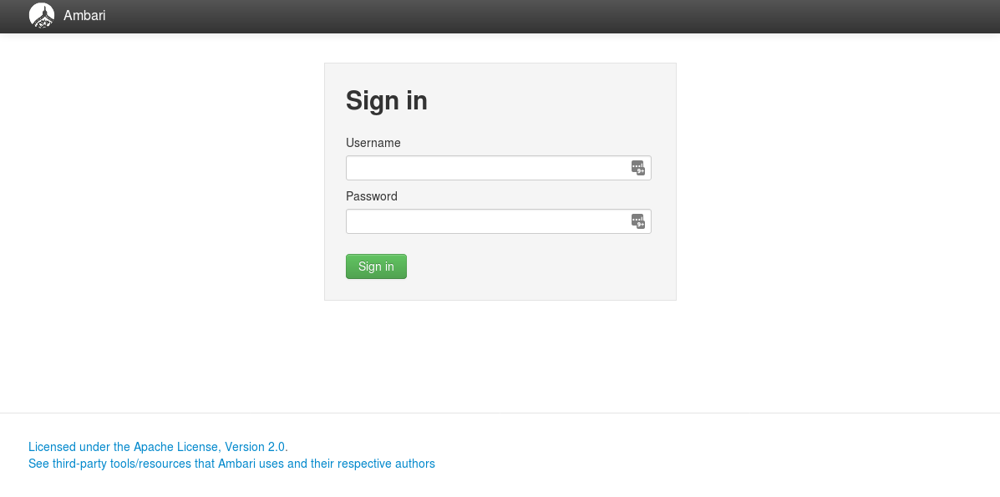
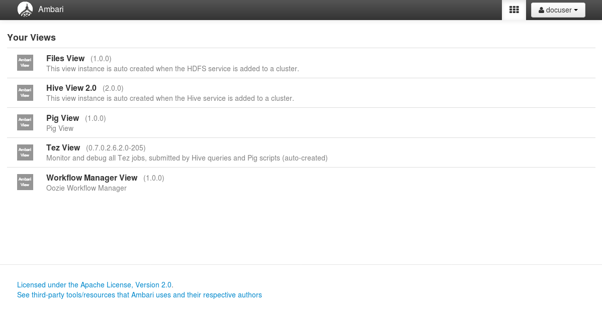
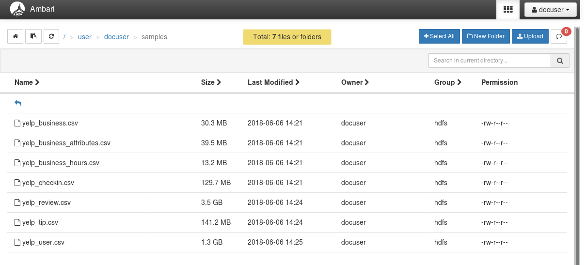
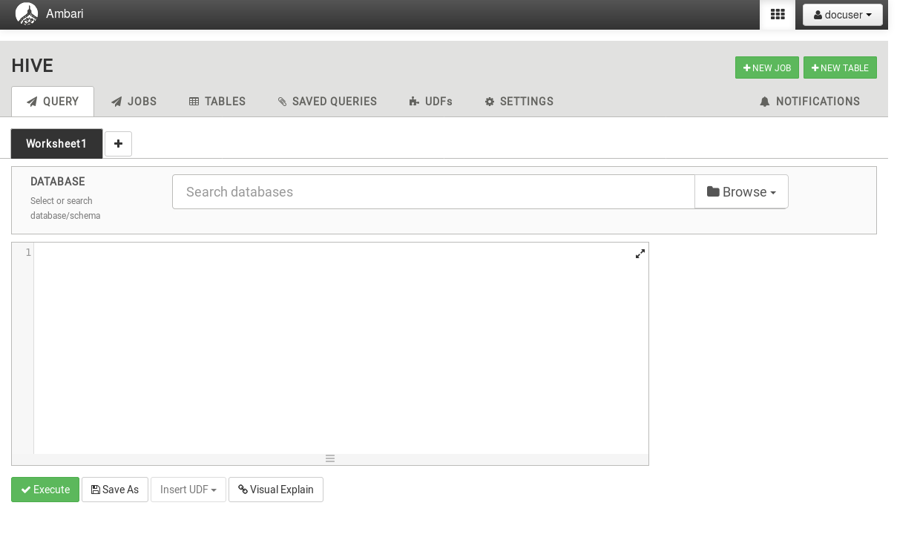
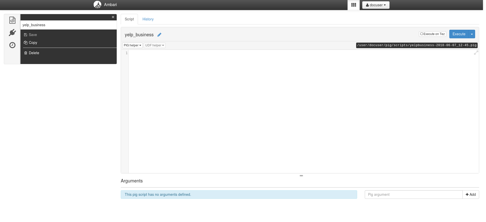
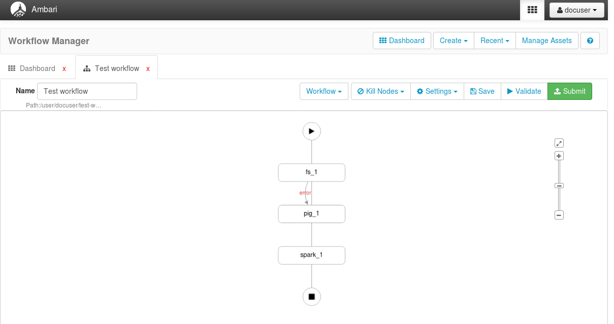

Ambari Views
============

In addition to CLI tools, EDI Big Data Stack provides a set of Ambari Views for
interacting with the cluster. Those views are Files View (WebHDFS), Pig View,
Hive View 2.0, Workflow Manager View (Oozie) and Tez View.

For accessing Ambari Views, access to
Ambari dashboard (|ambari_dashboard_url|) using your user and
password.

After a succesful login you can access to different Ambari Views.

.. _webhdfs:

Files View (WebHDFS)
--------------------

The Files View allows exploring and manipulating folders and files at HDFS.

.. _hiveview:

Hive View 2.0
-------------

Hive View 2.0 allows querying Hive databases and tables through a graphical
interface. You can also save Worksheets and generated results.

.. _pigview:

Pig View
--------

Pig View allows launching and saving Pig jobs.

.. _workflow:

Workflow Manager View
---------------------

Workflow Manager View allows designing and running Oozie jobs easily.

