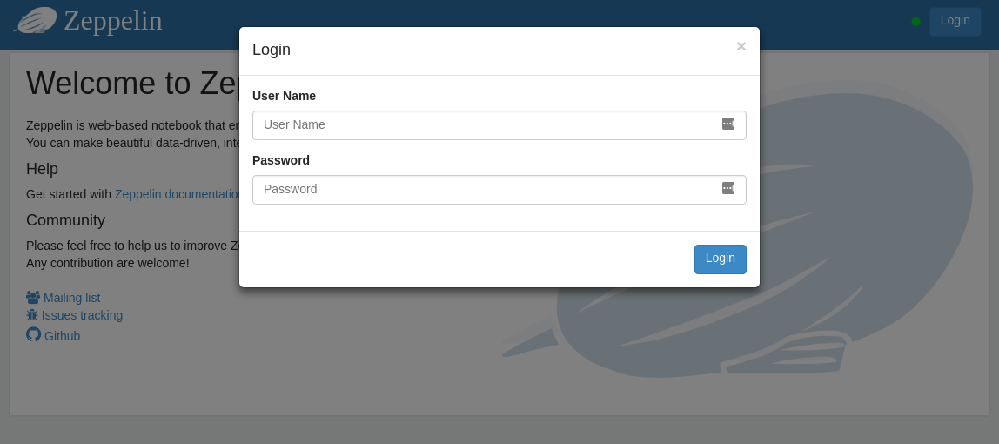
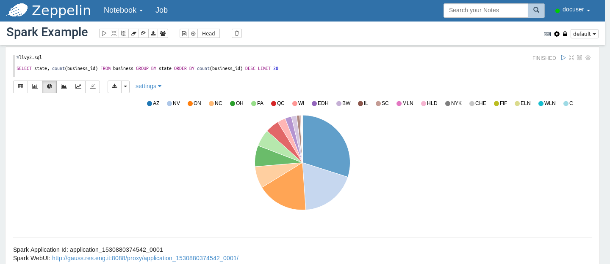

Zeppelin
========

`Apache Zeppelin <https://zeppelin.apache.org/>`_ is Web-based notebook that
enables data-driven, interactive data analytics and collaborative documents
with SQL, Scala and more. Zeppelin is formed by a set of interpreters that
executes code using different Hadoop tools. Interpreters available at EDI Big
Data Stack are Livy2 (Spark2), JDBC (Hive and Phoenix), Markdown and Angular.
In this example we explain how to reproduce the Spark, Hive and HBase example
from this documentation at a Zeppelin notebook.

First, access to Zeppelin at http://gauss.res.eng.it:9995 and click into `Login`
button to access with your credentials.

.. todo::

  Replace Zeppelin URL by production URL.

Click on `Create new note`, enter a name for the note and click on `Create Note`.

Livy2 (Spark2)
--------------

In this example we reproduce the example shown at :ref:`spark2`. To use Livy2
interpreter with pyspark, we must use the `%livy2.pyspark` prefix. Enter the
following code in the paragraph and run it:

.. code-block:: python

  %livy2.pyspark
  business_df = spark.read.csv('/user/<username>/samples/yelp_business.csv', header=True, quote='"', escape='"')
  state_count = business_df.groupBy(business_df.state).count()
  sorted_state_count = state_count.sort("count", ascending=False)
  sorted_state_count.write.csv('/user/<username>/zeppelin-spark-csv-output')

You can check the result at /user/<username>/zeppelin-spark-csv-output. In addition,
you can explore data using `livy2.sql` interpreter. In a new paragraph, write
the following an run it:

.. code-block:: python

  %livy2.pyspark
  business_df.registerTempTable("business")

In a new paragraph, you can query this data using SQL queries:

.. code-block:: sql

  %livy2.sql
  SELECT state, count(business_id) FROM business GROUP BY state ORDER BY count(business_id) DESC LIMIT 20

As you can see, Zeppelin allows creting charts in a very easy way.

Hive
----

For querying Hive the JDBC interpreter is used, with the `%jdbc(hive)` prefix.
In a new note, write the following code for inspecting a Hive table:

.. code-block:: sql

  %jdbc(hive)
  SELECT state, count(business_id) as business_count FROM <username>_yelp.yelp_business GROUP BY state ORDER BY business_count DESC LIMIT 20

As you can see, we get the same result obtained at other examples.

HBase
-----

HBase can be queried through Apache Phoenix. Apache Phoenix is an interface
for querying HBase tables using SQL queries. You can get more information about
how to use Phoenix in EDI Big Data stack at :ref:`phoenix`.

For queriying Phoenix at Zeppelin, we can use the JDBC connector to get the result:

.. code-block:: sql

  %jdbc(phoenix)
  SELECT "info"."state", count(ROWKEY) as business_count FROM "<username>"."yelp_business" GROUP BY "info"."state" ORDER BY business_count DESC LIMIT 20
