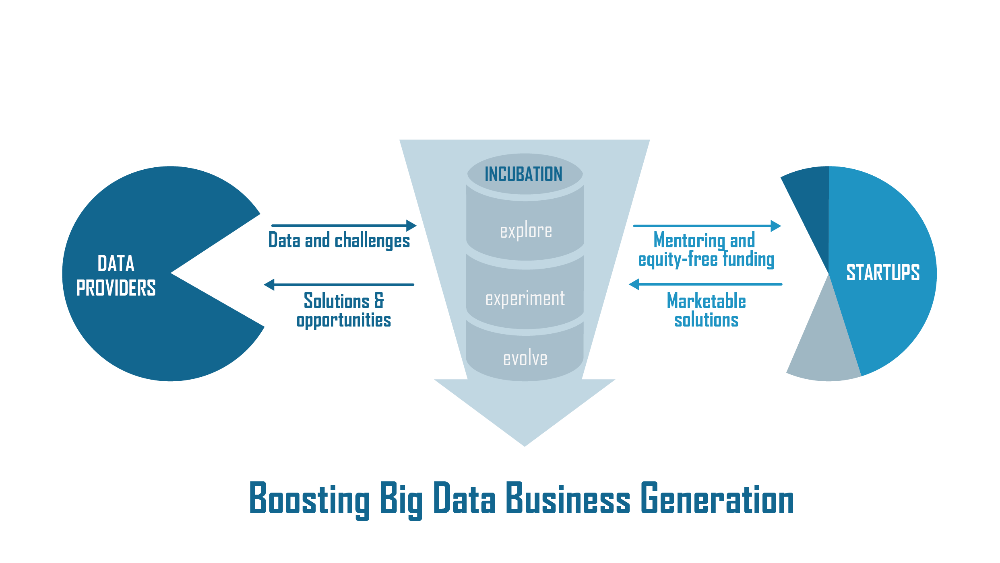
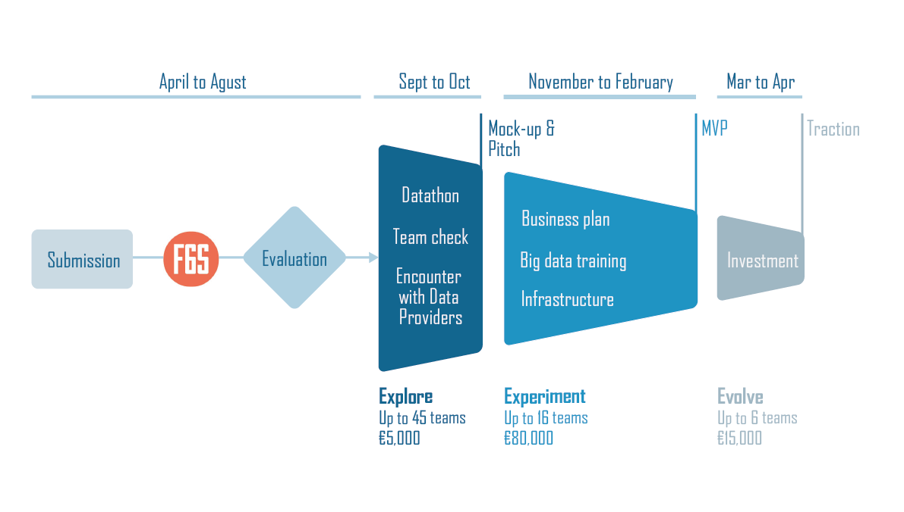

.. European Data Incubator documentation master file, created by
   sphinx-quickstart on Thu Apr 12 08:40:14 2018.
   You can adapt this file completely to your liking, but it should at least
   contain the root `toctree` directive.

European Data Incubator's documentation
===================================================

`European Data Incubator <http://edincubator.eu>`_ is an Innovation Action
project co-funded by the European Union. The
project has received funding from the European Union’s Horizon 2020 Research
and Innovation programme under Grant Agreement No 779790. Furthermore, EDI is
part of the Big Data Value PPP within a group of projects known as the Big Data
Value PPP projects.

Many SMEs are facing a number of problems when attempting to develop a sort of
comprehensive data strategy. The tools required to make successful data
management an achievable prospect often require an up-front capital investment.
The data remains in silos and its availability or cross-domain value is still
unperceived. EDI will help them jump this hurdle providing:

  1. A free infrastructure with open source tools.
  2. Training on the most known off-the-self solutions.
  3. Support and business services to develop their business idea and
  4. Equity-free funding.

The main objective of EDI will be to leverage the technology and knowledge on
Big Data across countries and sectors thanks to the incubation of
start-ups/SMEs who use Big Data open source tools oriented to sort out major
challenges in different business which facilitate their data assets.

During the duration of the project, EDI expects to incubate around 140
companies under a 3-phase incubation programme (funnel approach) launching 3
call for proposals and disbursing up to €5M equity-free and committing to raise
additional financing resources up to €15M for them from private investors
mainly.

In this documentation you can find tutorials and examples on how to interact
with the Big Data Stack offered by EDI.

Contents
--------

.. toctree::
   :maxdepth: 3

   big-data-stack/architecture
   big-data-stack/basic-concepts

TODO-list
---------

.. todolist::
