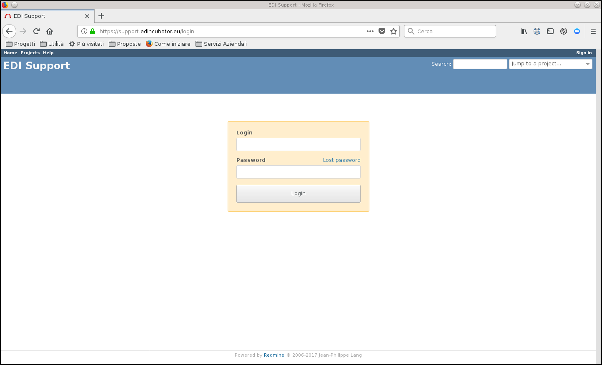
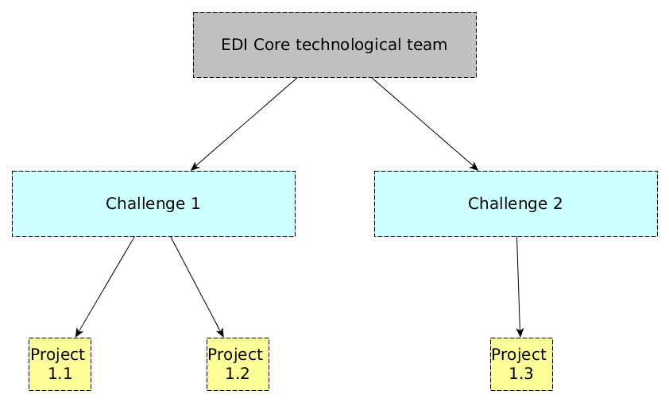

.. _technical-support:

EDI Technical Support
=====================

Starting from the Explore phase, each approved participant carries out a *project*
to design and develop the proposed solution. EDI provides a unique tool to manage each 
project and to quickly interact with EDI's technical team and with the Data Providers.

The tool is based on a customized version of `Redmine`_ and is available on EDI's `support`_
site.

EDI support tool
----------------

The functionalities provided by the tools are the following:

   1. **Project management**, including time tracking in order to schedule the activities and evaluate time and effort
   2. **Issue tracker**, to raise tickets addressed to:

      * the members of the same project, to better manage the whole lifecycle
      * the corresponding data providers, to report issues concerning data
      * EDI techical team, to report issues concerning the provided services, such as the infrastructure or the Generic Enablers
   3. Per project **Wiki**.

The tool supports a featured very comprehensive user management system that assures isolation between
the projects and enables to report issues to the stakeholders involved in each artivity. More in details
 the users are organized in hierarchical groups related to the associated project, the challenge on which
 the project is based and having as root the group of EDI's Core Partners. 

Each group has the visibility of the tickets related to the same group and its children. This means that 
the members of a specific `challenge`, who belong to the involved Data Provider (or Data Providers, for the
Cross Sector Challenge) can see the tickets related to the projects that use their datasets. They cannot 
see the tickets concerning the projects affering to different challenges. Similar policy is valid to address the
tickets: each group can address tickets to its ancestors. EDI's Core (technological) team has full visibility
of the projects and the tickets.

Account and usage
-----------------

Data Providers and participants can obtain an account by sending a email to 
support@edincubator.eu: it will be necessary to explicitly accept the `Privacy`_ 
and `Usage`_ Terms.

An User Guide is available in `Redmine Official Documentation`_.

 

.. _Redmine: http://www.redmine.org

.. _support: https://support.edincubator.eu  

.. _Privacy: https://support.edincubator.eu/projects/privacy/wiki/Privacy_Policy 

.. _Usage: https://support.edincubator.eu/projects/privacy/wiki/Terms_and_Conditions 

.. _Redmine Official Documentation: http://www.redmine.org/projects/redmine/wiki